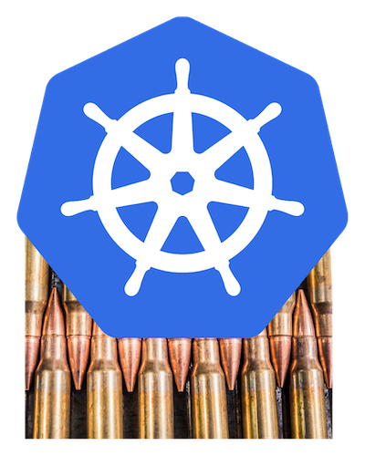

# Full Metal Kube

What is the best way to run [Kubernetes](https://kubernetes.io)? **Bare Metal!**

As Bryan Cantrill says, ["God is angry when you run containers on VMs!"](https://youtu.be/coFIEH3vXPw?t=1430)

"Aha," you say, "running Kubernetes on bare metal isn't easy! Actually, just about every guide - and those aren't too easy either - assumes you have VMs and ELBs and all the other cloud services available! How can I make it easier to run Kubernetes on bare-metal??"

Welcome... to **Bare Metal Kube**

## Purpose
This guide is here to help you deploy Kubernetes on bare-metal. Whether you are a first-time Kubernetes-on-bare-metal deployer, or a seasoned expert, we will make this your home for deployment and resources, over and over again.

This guide is broken down into three (very helpful) sections: "Guide Me", "Cloud Me", and "Resource Me".

### Guide Me
Guide Me is a step-by-step guide to deploying and managing Kubernetes on bare-metal. We look at what is needed, what is provided by cloud providers and you (might) have to replace yourself, and how it all looks. We take inspiration from [Kelsey Hightower's](https://twitter.com/kelseyhightower) always helpful [Kubernetes the Hard Way](http://github.com/kelseyhightower/kubernetes-the-hard-way). 

I'm ready for you to [Guide Me](./guide-me/)

### Cloud Me
Cloud Me is dedicated to bare metal clouds. They solve a lot of the issues of running on metal by providing resources on-demand and APIs to manage them, while still giving you the ability to get the performance you need from metal and the opportunity to use custom hardware.

Let's fly! [Cloud Me](./cloud-me/)

### Resource Me
Resource Me is the definitive index of bare metal Kubernetes resources on the Internet. It includes guides, use cases, blog posts, and lists of implementations to use on your bare metal Kibernetes. It will remain always up to date.

I want the best, always-up-to-date bare-metal Kubernetes resources! [Resource Me](./resource-me/)

## Sponsorship
We would like to thank the good folks at [Packet](https://packet.com), the world's premier and easiest bare-metal cloud provider. Get true, dedicated bare-metal servers by the hour, managed via a true on-demand cloud API. 

